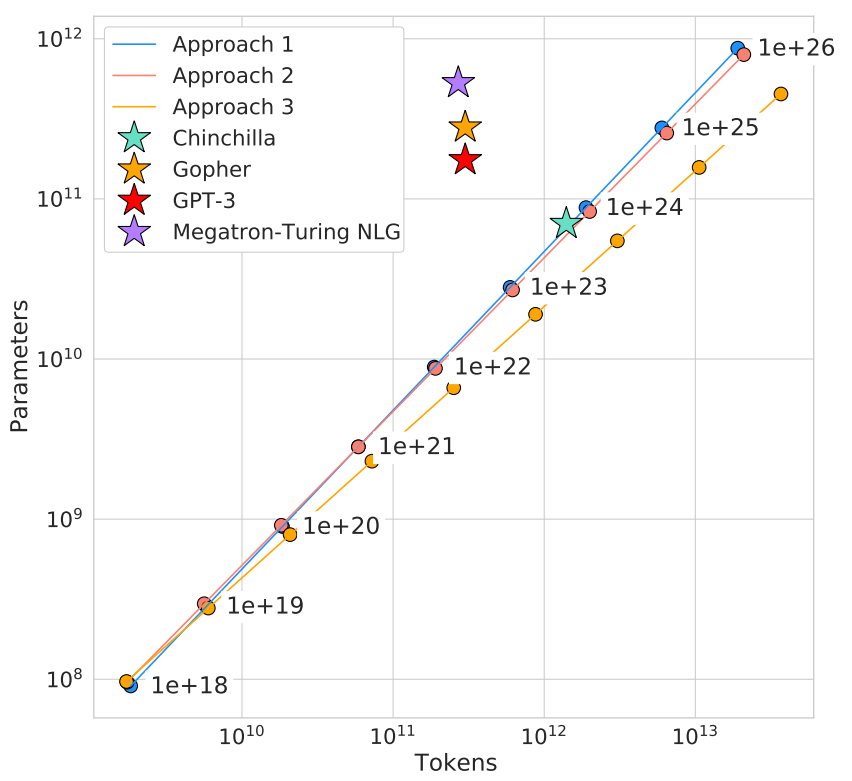
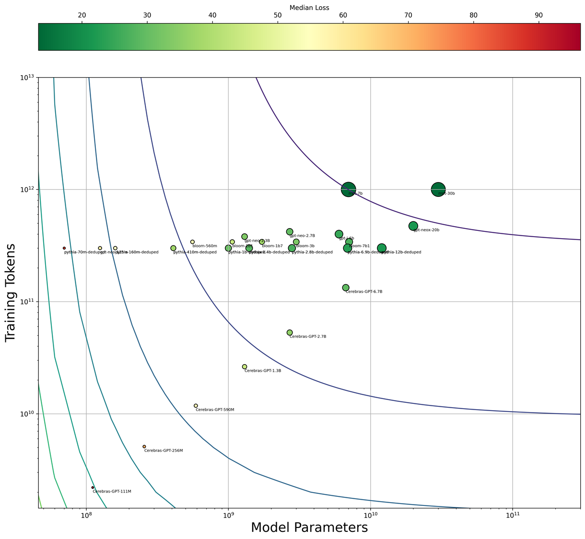

# Final Report: Crowd Sourcing Scaling Laws

## Ryan Felix & Addison Hanrattie

### CMSC 473/673: Capstone in Machine Learning

### Tom Goldstein, PhD Fall 2023

**Introduction**

As the training corpus for large language models continues to expand, it
becomes increasingly important to train these models in a
compute-optimal manner. Non-optimal training strategies suffer from
unwieldy computational costs, diminishing returns in performance, and an
adverse environmental impact (Lacoste et al., 2019; Strubell et al.,
2019). Neural scaling laws are a useful tool for combating the imbalance
of training data and model size (Bahri et al., 2021; Kaplan et al.,
2020). These represent mathematical rules that depict the relationship
between the model size, the volume of training data, and the resultant
performance. In the context of LLMs, these relate testing loss to the
number of model parameters and training tokens.

The exigency of neural scaling laws has been recognized by several
research teams who have attempted to demonstrate that compute-optimal
models outperform those that are “over-trained” for their model size or
“under-trained” for their training dataset. For example, in Hoffman et
al. 2022 the *Chinchilla* model is developed and its ability to
outperform similar models, such as *Gopher*, are attributed to its
superior compute-optimal training strategy (Hoffmann et al., 2022).
Currently, scaling laws have been elucidated by empirical means, and
mathematically represented by simple parametric fits of few parameters.
In these fits, the test-set loss to be minimized, $L(N,T)$, is a
function of the number of parameters, $N$, and the number of training
tokens, $T$ (Hoffmann et al., 2022; Maloney et al., 2022).

$(Eqn.\ 1)\ \ \ L(N,T) = \ E + \ \frac{A}{N^{\alpha}} + \ \frac{B}{T^{\beta}}\ $

Where, A, B, α, β, are all constants fit to the empirical data. As you
can see from this formulation, if $N \gg T$, the loss becomes dominated
by the amount of training data. Likewise, when $T\  \gg \ N$, the lack
of model parameters provides the prevailing limitation on loss
minimization. This suggests that as either $N$ or $T$ increase, the
other should be increased proportionally to prevent compute imbalances.
In the case of the 2022 Hoffman study, the authors investigate the
scaling of several LLMs. Specifically, GPT-3, Gopher, and
Megatron-Turing NLG. Their investigations suggest that all these large,
openly accessible models deviate from their compute-optimal training
based on either model parameters or training
tokens.

Despite performing several robust analyses of LLM scaling behavior, many
studies neglect other hyperparameters in their parametrization of
testing loss. For example, the batch size, optimizer choice, learning
rate, among other critical model-development characteristics are not
included in the scaling fit. Furthermore, most studies focus on
comparison of models within an order of magnitude of one, which
overlooks whether these laws continue to hold up for modern language
models with vastly different orders of magnitude.

Here we pursue more generalizable models of scaling laws, spanning a
larger range of parameters and tokens, and investigating the effects of
hyperparameters. In part, our approach aims to allow the broader LLM
community to contribute new model results, such that the accuracy of our
scaling laws improves over time. Ultimately, we hope that our efforts
will allow future LLM manufacturers to reduce non-optimal usage of
compute, thus saving on wasted computational time and effort, reducing
needless energy expenditures, lowering overall training costs, and
providing a benchmark for achieving specific model performances.

**Methods**

*Data Abstraction*

To accomplish our goals, we first set out to collect information from
open-source language models developed by prominent & reputable
manufacturers who published their model weights, training amounts and
corpus composition, as well as quantitative hyperparameter values. The
common data sources were Hugging Face and model announcement whitepapers
or websites. We were successful in collecting data from over 40
different models ranging in size from 44 million parameters up to 180
billion and trained on anywhere from 2.2 billion to 3.5 trillion tokens.
A full list of models and abstracted data are described in our Appendix.

*Evaluation Metrics*

Following data abstraction tasks, we worked to incorporate a simple
evaluation metric to compute the losses of each model. Each evaluation
dataset was downloaded first from HuggingFace and then the first 5000
strings from each dataset were saved locally in pickle files after
reformatting them to reduce calls to HuggingFace.

The standard evaluation metric we utilized was perplexity, effectively a
probabilistic assessment of how well the model predicts the next token
in the set given the previous tokens. Perplexity was computed using the
following formulation:

$(Eqn.\ 2)\ \ \ \ \ Perplexity(X) = exp\left\{ - \frac{1}{t}\sum_{i}^{t}\log p_{\vartheta}\left( x_{< i} \right) \right\}$

where, Perplexity(X) refers to the perplexity of an entire sequence of
*t* tokens, computed as the sum of the log probability of each
individual token in the sequence, where *i* represents the
*ith* token. Perplexity has a number of advantages to other
ways of evaluating models. Firstly, it is objective and can be agreed
upon by everyone for a given string of tokens. Following this perplexity
is also fairly straightforward to calculate and thus allows us to fit
our laws to the largest available LLMs. Perplexity is also proportional
to the loss which dictates how models are updated during training.
Finally, perplexity is the colloquially accepted way to calculate
scaling laws in large part due to those benefits. However, it does
suffer from a couple limitations, most notably, it may not relate well
to intuitive human evaluations of what the next-best token should be.

At the time this paper is being written we have finished implementing
code to calculate the perplexity on the C4 dataset. This code can be
found on our GitHub however it mainly is a few calls to some lightly
modified code from the HuggingFace libraries to allow for our specific
use case. We still need to fine-tune the code used to calculate the
perplexity for the ORCA perplexities. We have code which can properly
calculate the perplexities right now, however, it is inefficient as it
calculates the perplexity for the whole string rather and then throws at
those corresponding to the prompt rather than solely calculating the
perplexity for the answer text.

*Model Fitting*

Our initial model fitting was agnostic to hyperparameters and utilized
the methods of Hoffman et al. 2022. In brief, a direct fit of Eqn. 1 is
hindered by computational overflow, thus requiring reformulation as a
LogSumExp:

${(Eqn.\ 3)\ \ \ \ \ L}_{pred.}\left( N_{i},T_{i} \right)_{i} = LSE\left( a - \alpha log\left( N_{i} \right),\ b - \beta\log log\ \left( T_{i} \right)\ ,e \right)$

The true losses were calculated as described above in Equation 2. We
then performed a minimization of the Huber loss, wherein this
robust-to-outliers loss was represented by the difference between the
predicted loss in Equation 3, and the true loss (Eqn. 2) from
experimentation:

$(Eqn.\ 4)\ \ \min_{a,b,\alpha,\beta,e}\sum_{i}^{}{Huber}_{\delta}\left( L_{pred.}\left( N_{i},T_{i} \right) - L_{exper.}\left( N_{i},T_{i} \right) \right)$

This minimization was performed using the L-BFGS-B method, a Huber delta
of 10-3, and an initialization grid for all fit constants.
Cross-validation was utilized in a 10-fold-10 manner to improve the
generalizability of the fit, and the final model was selected as the
validation result with the highest coefficient of determination. Our
secondary model fit incorporated model hyperparameters and therefore
required reformulation of Equation 1.

For the C4 side that was completed we were able to run the model on a
majority of the LLMs which were less than 3B parameters. It is our hope
that we will be able to obtain more powerful computers which we could
then run the larger model such a Falcon-180B on. If we are not able to
obtain access to more powerful we will likely use our own machines for
such large models however that will mean a much longer compute time.

*Dissemination of Results*

Our results are publicly available to the broader machine learning
community via our [<u>Github
repository</u>](https://github.com/supersimple33/Scaling-Laws). It is
our hope at the end of this project will support the compute-optimal
training of future machine learning models, and we encourage those who
find it useful to provide their LLMs and training information such that
we can continue to improve the scaling laws presented here.

**GitHub Repository:** https://github.com/supersimple33/Scaling-Laws

**Link to model data:** [<u>LLM
Data</u>](https://docs.google.com/spreadsheets/d/1AfJkyoON9nvx65kwER9VdNfA_SKw-9vx5OZ1bQ3YtDo/edit?usp=sharing)

## References:

Bahri, Y., Dyer, E., Kaplan, J., Lee, J., & Sharma, U. (2021).
*Explaining Neural Scaling Laws* (arXiv:2102.06701). arXiv.
https://doi.org/10.48550/arXiv.2102.06701

Hoffmann, J., Borgeaud, S., Mensch, A., Buchatskaya, E., Cai, T.,
Rutherford, E., Casas, D. de L., Hendricks, L. A., Welbl, J., Clark, A.,
Hennigan, T., Noland, E., Millican, K., Driessche, G. van den, Damoc,
B., Guy, A., Osindero, S., Simonyan, K., Elsen, E., … Sifre, L. (2022).
*Training Compute-Optimal Large Language Models* (arXiv:2203.15556).
arXiv. https://doi.org/10.48550/arXiv.2203.15556

Kaplan, J., McCandlish, S., Henighan, T., Brown, T. B., Chess, B.,
Child, R., Gray, S., Radford, A., Wu, J., & Amodei, D. (2020). *Scaling
Laws for Neural Language Models* (arXiv:2001.08361). arXiv.
https://doi.org/10.48550/arXiv.2001.08361

Lacoste, A., Luccioni, A., Schmidt, V., & Dandres, T. (2019).
*Quantifying the Carbon Emissions of Machine Learning*
(arXiv:1910.09700). arXiv. https://doi.org/10.48550/arXiv.1910.09700

Maloney, A., Roberts, D. A., & Sully, J. (2022). *A Solvable Model of
Neural Scaling Laws* (arXiv:2210.16859). arXiv.
https://doi.org/10.48550/arXiv.2210.16859

Strubell, E., Ganesh, A., & McCallum, A. (2019). *Energy and Policy
Considerations for Deep Learning in NLP* (arXiv:1906.02243). arXiv.
https://doi.org/10.48550/arXiv.1906.02243
